# Customer Shopping Behavior Analysis

**Tools:** Python · MySQL · Power BI  
**Data:** 3,900 customers · 18 columns · 4 product categories  
**Skills shown:** Data cleaning · Feature engineering · SQL window functions · CTEs · Dashboard design

---

## Summary

Analyzed 3,900 customer records to find what actually drives purchases, and whether discounts, subscriptions, and age groups matter as much as assumed.

---

## The Problem

Raw shopping data rarely arrives clean. This dataset had null values, redundant columns, and text-based frequency fields that needed numeric conversion before any analysis was possible. The goal was to clean it, load it into MySQL, answer 13 business questions, and build a dashboard that makes the findings readable.

---

## The Dataset

**Source:** Customer Shopping Behavior Dataset (Kaggle)  
**Coverage:** 3,900 records · 18 columns

| Column | What It Means |
|---|---|
| `purchase_amount` | Amount spent per transaction |
| `review_rating` | Customer rating (1 to 5) |
| `discount_applied` | Whether a discount was used |
| `subscription_status` | Whether customer is subscribed |
| `previous_purchases` | Total number of past purchases |
| `age_group` | Engineered: Young Adults / Adults / Middle-aged / Seniors |

---

## Data Cleaning (Python)

**File:** `Customer_shopping_behavior_analysis.ipynb`

Steps taken:

- Standardized all column names to snake_case
- Found and handled 37 null values in `review_rating`
- Discovered that `discount_applied` and `promo_code_used` were identical across every row. Dropped `promo_code_used` as redundant
- Mapped `frequency_of_purchases` from text labels to numeric values
- Created `age_group` column for age-based segmentation
- Loaded cleaned dataset into MySQL using SQLAlchemy

---

## SQL Analysis (13 Business Questions)

**File:** `Customer_Behavior.sql`

---

**Q1. What is the total revenue generated by male vs female customers?**

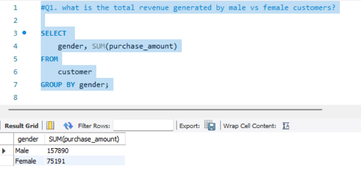

Male customers generated $157,890 vs $75,191 for female customers. The dataset skews heavily male which likely explains most of this gap rather than any behavioral difference.

---

**Q2. Which customers used a discount but still spent more than the average purchase amount?**

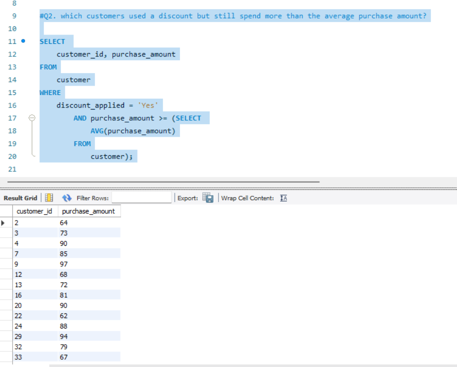

Used a subquery to calculate the average purchase amount ($59.76) dynamically. Returned all customers who used a discount but still spent above that threshold.

---

**Q3. Which are the top 5 products by average review rating?**

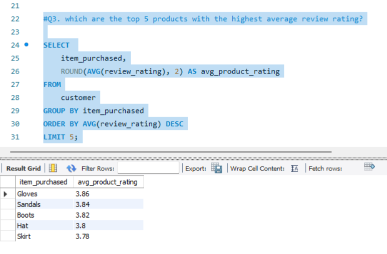

Gloves (3.86), Sandals (3.84), Boots (3.82), Hat (3.80), Skirt (3.78). Ratings are tight across the top 5, suggesting overall satisfaction is fairly uniform across product types.

---

**Q4. Compare average purchase amount between Standard and Express shipping.**

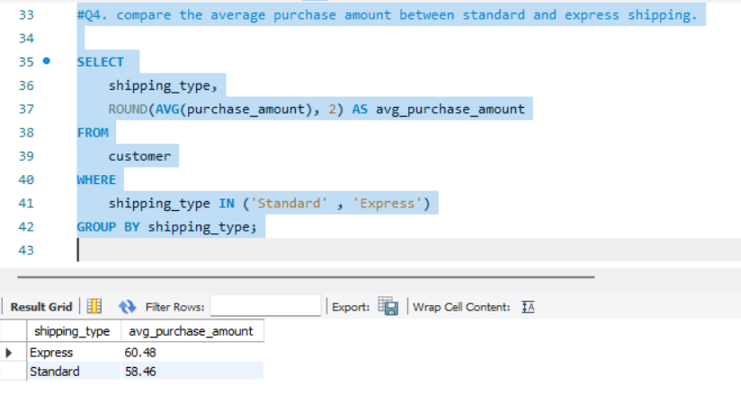

Express shipping customers spend slightly more on average ($60.48) vs Standard ($58.46). The difference is small but consistent.

---

**Q5. Do subscribed customers spend more?**

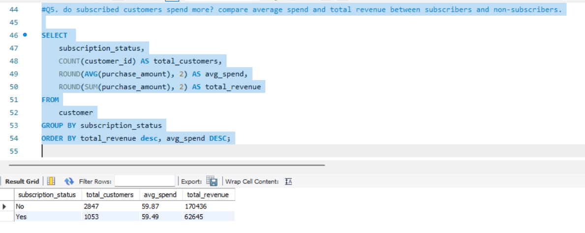

No. Non-subscribers average slightly higher spend ($59.87) vs subscribers ($59.49). Non-subscribers also make up 73% of the customer base (2,847 vs 1,053). The subscription program does not appear to be driving higher spend.

---

**Q6. Which 5 products have the highest discount usage rate?**

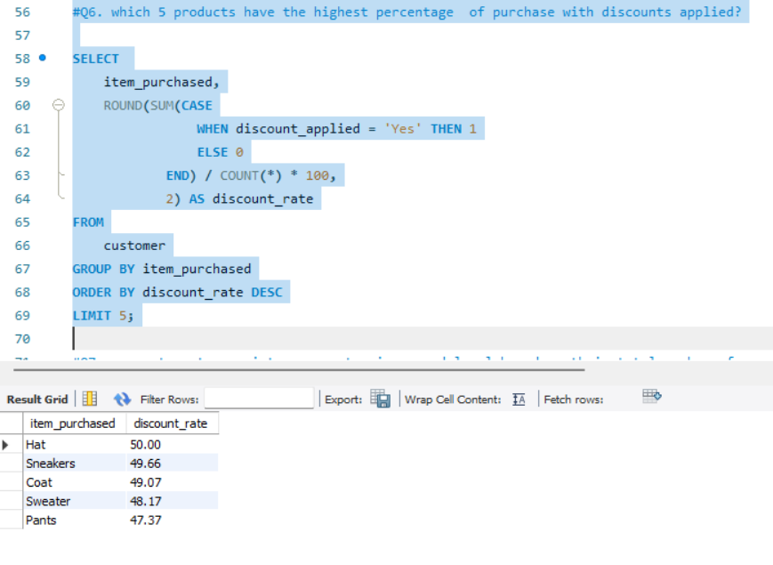

Hat (50%), Sneakers (49.66%), Coat (49.07%), Sweater (48.17%), Pants (47.37%). Used a CASE statement inside SUM to calculate discount rates as percentages.

---

**Q7. Segment customers into new, returning, and loyal.**

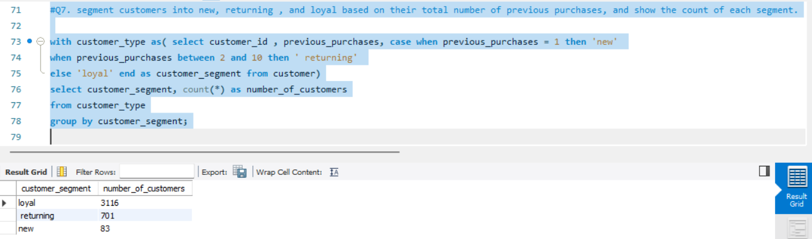

Results: 3,116 loyal (11+ purchases), 701 returning (2 to 10), 83 new (1 purchase). 80% of the customer base is loyal, which is unusual and worth flagging as a potential data quality note.

---

**Q8. What are the top 3 most purchased products within each category?**

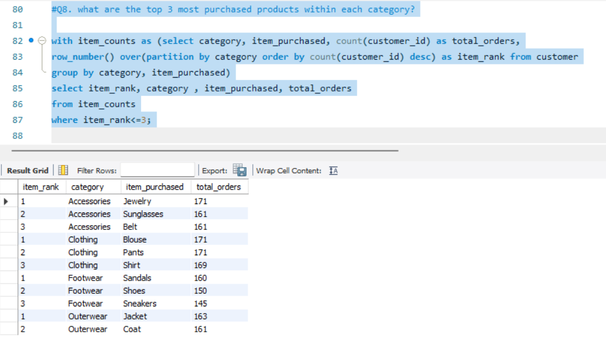

Used `ROW_NUMBER() OVER(PARTITION BY category)` to rank products within each category. Top sellers: Jewelry (Accessories), Blouse and Pants tied (Clothing), Sandals (Footwear), Jacket (Outerwear).

---

**Q9. Are repeat buyers likely to subscribe?**

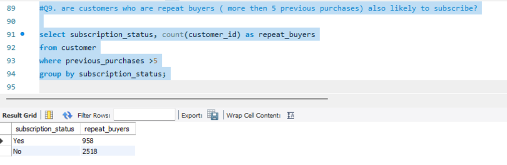

Among customers with more than 5 previous purchases: 2,518 are not subscribed vs 958 who are. Repeat buying does not predict subscription behavior.

---

**Q10. What is the revenue contribution of each age group?**

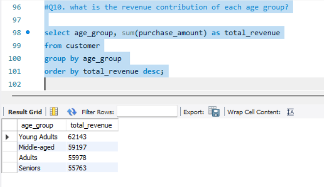

Young Adults lead at $62,143, followed by Middle-aged ($59,197), Adults ($55,978), and Seniors ($55,763). Revenue is fairly even across age groups, suggesting age is not a strong revenue driver here.

---

**Q11. Which payment method is most popular among loyal vs new customers?**

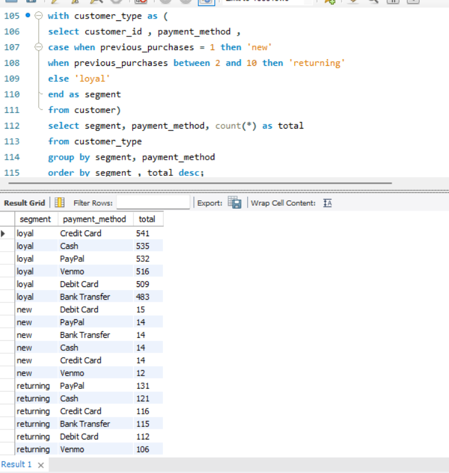

Used a CTE to segment customers first, then crossed with payment method. Loyal customers are evenly distributed across all payment methods (Credit Card 541, Cash 535, PayPal 532, Venmo 516, Debit Card 509, Bank Transfer 483). New customers are too few (83 total) to draw conclusions.

---

**Q12. Which season drives the most revenue and which category leads each season?**

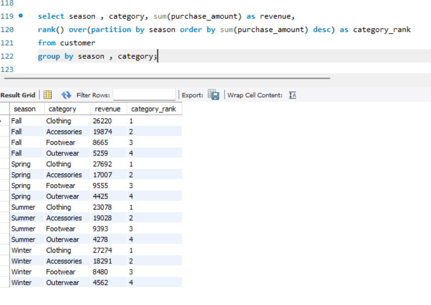

Used `RANK() OVER(PARTITION BY season)` to find the top category per season. Clothing ranks first in every single season without exception. Spring leads overall at $27,692. Accessories consistently ranks second. Seasonal promotions should lead with Clothing regardless of time of year.

---

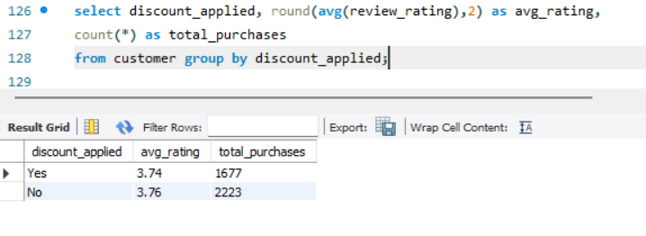

**Q13. Does applying a discount affect review ratings?**

Discounted purchases average 3.74 vs 3.76 for non-discounted. Essentially no difference. Customers who use discounts are equally satisfied as those who pay full price.

---

## Power BI Dashboard

**File:** `Customer_behavior_Dashboard.png`

Single-page dashboard with slicers for subscription status, gender, category, and shipping type.

KPI cards: 3.9K customers · $59.76 avg purchase · 3.75 avg rating

Charts included:

- Subscription breakdown (donut) showing 73% non-subscribed
- Revenue by category showing Clothing leads across all seasons
- Sales volume by category
- Revenue and sales count by age group

---

## Key Findings

1. 73% of customers are not subscribed yet spend almost the same as subscribers. The subscription program is not driving higher spend.
2. Clothing dominates revenue in every single season, making it the most reliable category regardless of time of year.
3. Discounts do not meaningfully affect review ratings (3.74 vs 3.76). Customers are equally satisfied whether they paid full price or not.
4. 80% of customers are classified as loyal (11 or more purchases) and their payment method preferences are evenly distributed.
5. Revenue is fairly uniform across all age groups. Age is not a strong predictor of spend in this dataset.

---

## How to Run

1. Install requirements: `pip install pandas sqlalchemy mysql-connector-python`
2. Place `customer_shopping_behavior.csv` in the same folder
3. Run all cells in `Customer_shopping_behavior_analysis.ipynb`
4. Open `Customer_Behavior.sql` in MySQL Workbench and run queries

---

## About Me

Data analytics student building real projects on real data.

[GitHub](https://github.com/aiman-ami) · [LinkedIn](https://linkedin.com/in/aiman-ishaq)
